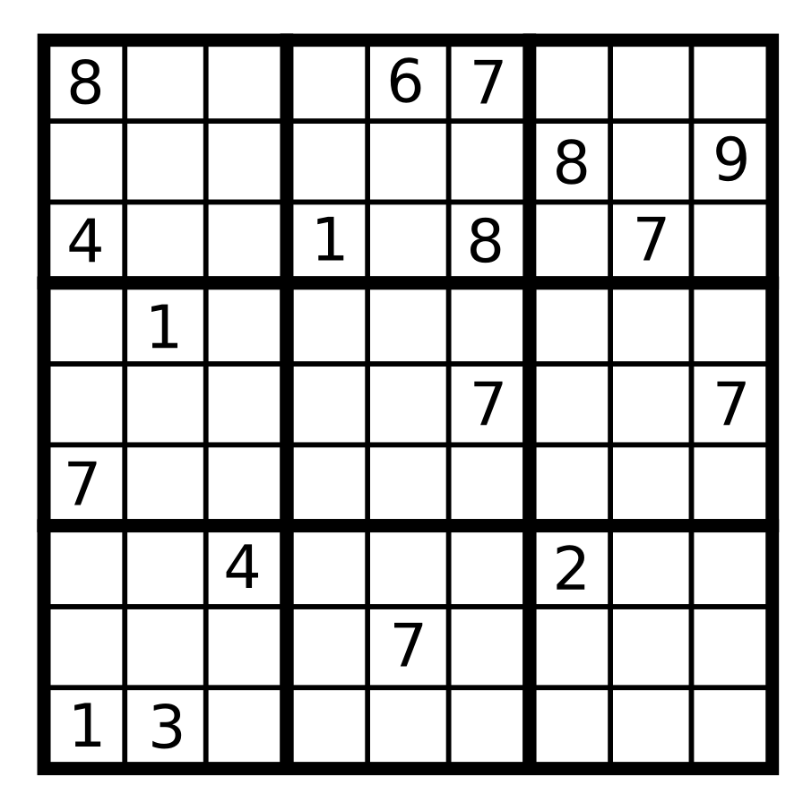
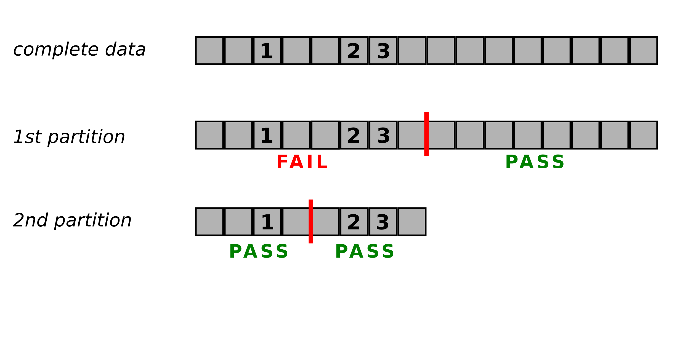
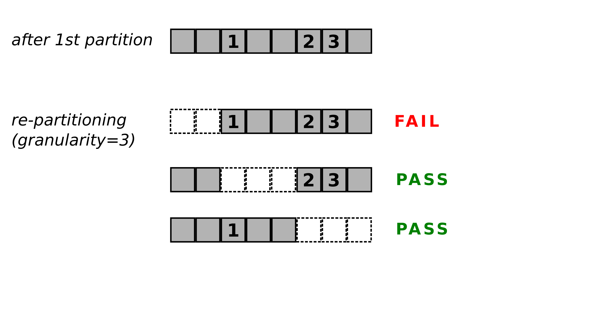
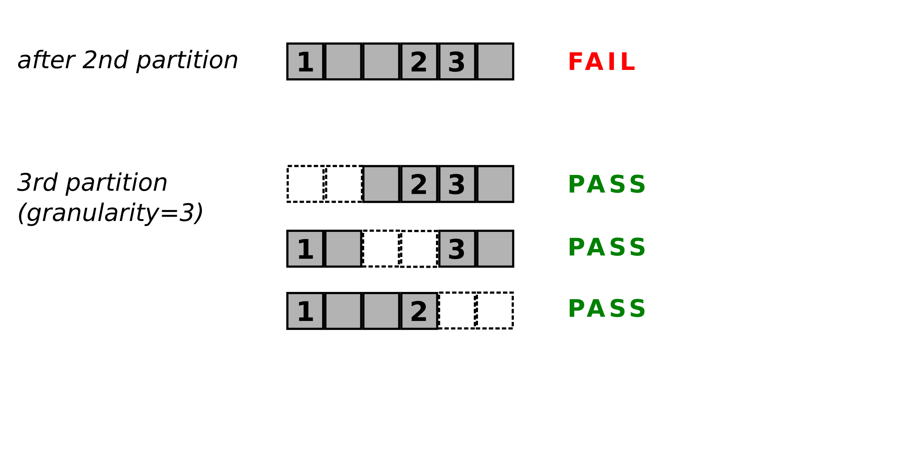
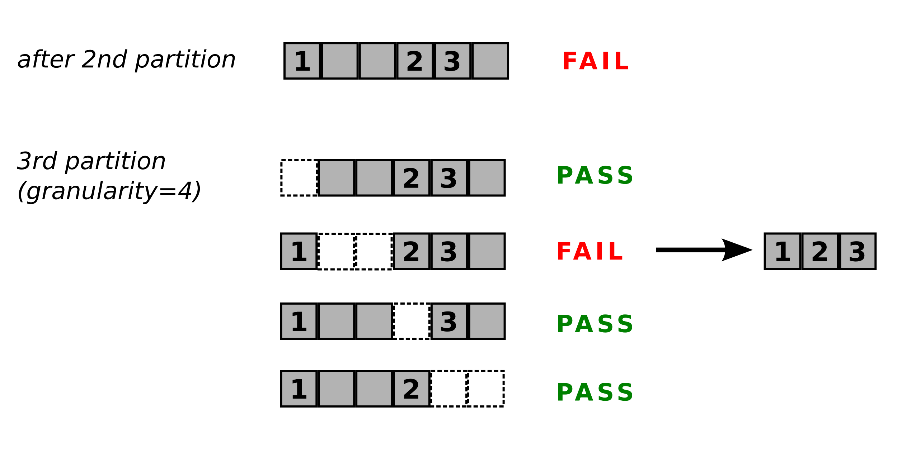

# Delta Debugging

explained by Kristian Rother

krother@academis.eu

*Distributed under the conditions of the Creative Commons Attribution Share-Alike License 4.0*

## What is Delta Debugging?

* a debugging approach by Andreas Zeller
* a method to minimize a failing data set
* a way to automate debugging
* a non-standard way to think about debugging

## Preparations

install `pulp`:
   
    pip install pulp

## The Problem

The program `sudoku.py` solves a sudoku using the linear solver **PuLP**:

    python sudoku.py

Imagine you have a Sudoku that is unsolveable, like the following:

You want to know the **minimal failing set**, the smallest input that reproducibly fails a test.

In our case, the test in `test_sudoku.py` checks whether a Sudoku is solveable.

## How Delta Debugging works

### Step 1: partition

First, the data is partitioned into two equal portions, like in *binary search*. In the representation, *1, 2* and *3* correspond to the places in the sudoku that cause the failure if they occur together:

The algorithm checks both partitions independently and continues with the failing one.

### Step 2: increase granularity

When all partitions pass the test, this means either that the minimal failing set has been found, or that the data causing the failure has been divided. To tell one from the other, the algorithm continues with **increased granularity**, trying 3 partitions instead of two:

The procedure is iterated recursively:

### Step 3: Return the minimal set

The algorithm stops when the granularity cannot be increased any further (because it is the same as the size of the remaining data). Then, the last failing partition is the *minimal failing set*.

## Pros and Cons of Delta Debugging

### Pros:
* Does not require knowlede about the nature of the bug
* Works on any iterable type
* Works well with random tests
* Related approach used by `git bisect`

### Cons:
* You need a test first
* Partitions must not have side effects
* Few examples documented since 1999
* Does not give the union of failing subsets

## Exercise

### 1. Write the function to be tested

Implement a Python function `print_animals(names)` that gets a list of animal names and prints them to the screen. The function must fail with an exception if two animals that don't get along well occur in the list, e.g.:

* cats and dogs
* wolves and pigs
* anteaters and ants

*In a real-world application of Delta Debugging, this would be your code under test.*

### 2. Write a test function

The test function `test_animals(data)` needs to call `print_animals()` and translate the result so that the Delta Debugging algorithm can understand it:

* If the function succeeds, the test function returns `'PASS'`.
* If the function fails, the test function returns `'FAIL'`.

### 3. Run the Delta Debugging algorithm

Execute the test function with some example data:

    data = ['pig', 'chicken', 'dog', 'anteater', 'wolf', 'piranha']
    delta_debug(data, test_animals)

See what happens!

## References

* Software Debugging course on Udacity:
[https://www.udacity.com/course/software-debugging--cs259](https://www.udacity.com/course/software-debugging--cs259)
* Book: Why Programs Fail: A Guide to Systematic Debugging. Andreas Zeller, dpunkt Verlag
* Lithium by Jesse Ruderman. A delta debugging tool used to find bugs in Mozilla: [https://github.com/MozillaSecurity/lithium](https://github.com/MozillaSecurity/lithium)
